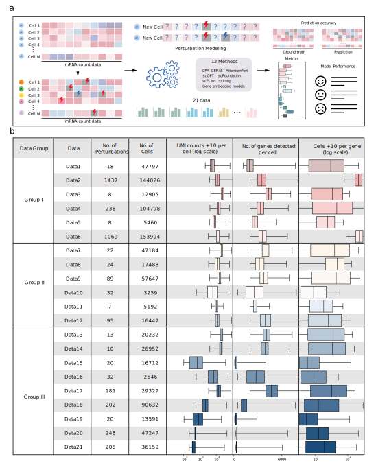

# Benchmarking Genetic Perturbation Prediction Models   for Transcriptional Response
## Description
Exploring the molecular responses of single cells to various influences—such as external stimuli or gene knockouts—is a crucial step toward demystifying the intricacies of cellular mechanisms. Although single-cell perturbation remains experimentally challenging at the current stage, burgeoning bioinformatic tools are accelerating the expansion of this field through in silico modeling. More strikingly, the recent surge in foundation models underscores the applicability of perturbation tasks as an indispensable downstream application. Therefore, a critical assessment of reliable perturbation tools is required. Here, we benchmark the performance of leading algorithms, including four conventional approaches and eight foundation models, using 21 paired perturbed or non-perturbed cell datasets of varying perturbation types and qualities. The results show that the conventional deep learning method GEARS and the foundation model scGPT outperform others in a comprehensive benchmark. Additionally, in certain tasks, the foundation models demonstrate promising potential through pre-training strategies or by ensembling with GEARS's perturbation embeddings. Our findings also highlight dataset quality, measured by E-distance, as a critical determinant of model performance. This study offers actionable insights for choosing the most suitable toolkit based on dataset characteristics and informs future development of robust, generalizable models for genetic perturbation predictions.
  

## Implementation
We implemented all 12 proposed methods using their default parameters as described in their respective publications. In the <code>/methods</code> folder, we provide the implementations of all methods on the <code>/demo_data</code> dataset as an example. For detailed information regarding each method, please refer to the following repositories:
[GRN](https://github.com/morris-lab/CellOracle), [CPA](https://github.com/theislab/cpa), [GEARS](https://github.com/snap-stanford/GEARS), [AttentionPert](https://github.com/BaiDing1234/AttentionPert), [scLong](https://github.com/BaiDing1234/scLong), [scGPT](https://github.com/bowang-lab/scGPT), [scFoundation](https://github.com/biomap-research/scFoundation), [scELMo](https://github.com/HelloWorldLTY/scELMo), [scBERT-G](https://github.com/TencentAILabHealthcare/scBERT), [Geneformer-G](https://huggingface.co/ctheodoris/Geneformer), [GenePT-G](https://github.com/yiqunchen/GenePT) and [ESM2-G](https://github.com/facebookresearch/esm).

The <code>/analysis_visualization</code> folder contains scripts for generating the visualizations and quantitative analyses presented in our manuscript and supplementary materials. To test any of the models on the <code>/demo_data</code> dataset, you can download the provided data, update the path to <code>pert_data</code> in the corresponding scripts within the <code>/methods</code> folder, and execute the code.

